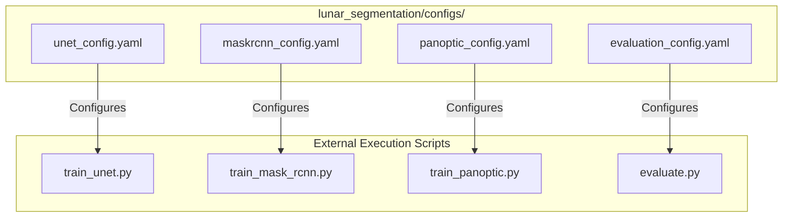

# Configuration Module

## 1. Folder Overview
The `configs` directory centralizes all declarative hyperparameter definitions, model architecture settings, and training orchestration schemas for the lunar segmentation project. Formatted in YAML, these configuration files decouple experimental parameters from source code, enabling reproducible model optimization, standardized evaluation campaigns, and rapid ablation studies across semantic, instance, and panoptic pipelines.

---

## 2. File Index
* **`evaluation_config.yaml`**: Specifies parameters for automated model validation and comparative reporting, defining dataset test paths, checkpoint locations, decision threshold grids, and target geological class lists.
* **`maskrcnn_config.yaml`**: Defines training hyperparameters and structural settings for Faster/Mask R-CNN instance segmentation, specifying learning rates, warmup schedules, anchor box generators, RoI align scales, and non-maximum suppression (NMS) thresholds.
* **`panoptic_config.yaml`**: Controls parameters for Panoptic Feature Pyramid Network (`PanopticFPN`) experiments, specifying loss weighting ratios between dense semantic segmentation, bounding box regression, and pixel-level instance mask criteria.
* **`unet_config.yaml`**: Configures `SmallUNet` semantic segmentation training, declaring encoder depth, base channel filter width, bottleneck/decoder dropout probabilities, batch sizes, optimizer choice, and learning rate decay schedules.

---

## 3. Topology and Data Flow
Within the directory, configuration files act as static parameter stores. They do not depend on external modules or internal logic; instead, they are parsed at runtime by training and evaluation execution scripts to instantiate models, optimizers, and data loaders.
Externally, this directory **exports** configuration schemas to:
* **`training/` & Root Training Scripts**: Consumed by `train_unet.py`, `train_mask_rcnn.py`, and `train_panoptic.py` to parameterize optimization loops and model constructors.
* **`evaluation/` & Root Evaluation Scripts**: Consumed by `evaluate.py` and `comparison.py` to dictate threshold sweeping and statistical reporting parameters.

---

## 4. Core APIs and Functions
Although configuration YAML files do not define executable Python classes or functions, they declare structured schema contracts consumed by the project's orchestration scripts. Below are the core parameter schemas for each file:

### `unet_config.yaml` Schema
* **Purpose**: Declares structural and optimization parameters for `SmallUNet` semantic training.
* **Key Parameters**:
  * `model.in_channels` (`int`, default: `3`): Number of input raster bands.
  * `model.num_classes` (`int`, default: `8`): Total segmentation classes including background.
  * `model.depth` (`int`, default: `4`): Number of downsampling/upsampling encoder-decoder stages.
  * `model.base_width` (`int`, default: `32`): Initial channel filter count.
  * `training.learning_rate` (`float`): Initial optimizer learning rate.
  * `training.batch_size` (`int`): Samples per gradient update step.

### `maskrcnn_config.yaml` Schema
* **Purpose**: Configures Faster/Mask R-CNN instance detection hyper-parameters.
* **Key Parameters**:
  * `rpn.anchor_sizes` (`List[int]`): Scales for Region Proposal Network anchor generation.
  * `roi_heads.nms_thresh` (`float`): Intersection over Union threshold for Non-Maximum Suppression.
  * `roi_heads.score_thresh` (`float`): Minimum confidence score required to retain detected objects.
  * `training.warmup_epochs` (`int`): Number of initial epochs with linear learning rate warmup.

### `panoptic_config.yaml` Schema
* **Purpose**: Balances multi-task loss terms for `PanopticFPN` optimization.
* **Key Parameters**:
  * `loss_weights.semantic_bce` (`float`): Multiplier for dense semantic binary cross-entropy loss.
  * `loss_weights.semantic_dice` (`float`): Multiplier for semantic Dice loss.
  * `loss_weights.instance_box` (`float`): Multiplier for bounding box smooth L1 regression loss.
  * `loss_weights.instance_mask` (`float`): Multiplier for pixel-level instance mask BCE loss.

### `evaluation_config.yaml` Schema
* **Purpose**: Governs validation execution and automated statistical comparison reporting.
* **Key Parameters**:
  * `evaluation.thresholds` (`List[float]`): Sequence of probability cutoffs for sensitivity sweeping.
  * `evaluation.bootstrap_iterations` (`int`): Resampling count for non-parametric confidence interval estimation.
  * `evaluation.alpha` (`float`, default: `0.05`): Significance level for Wilcoxon signed-rank hypothesis testing.
