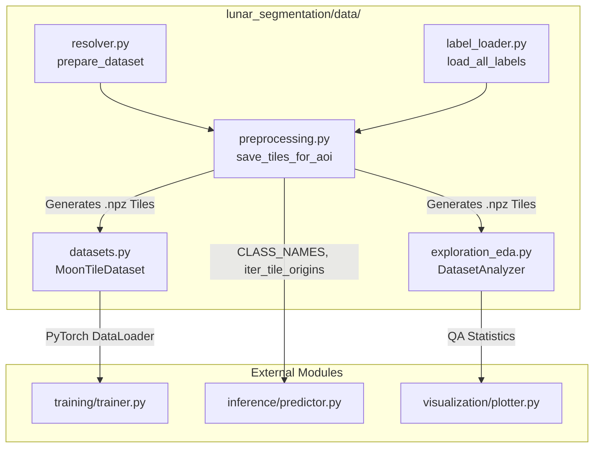

# Data Module

## 1. Folder Overview
The `data` directory manages the end-to-end data engineering and ingestion lifecycle for lunar geological segmentation. It handles automated downloading and caching of remote planetary datasets, unifies heterogeneous vector labels into a standardized lunar coordinate reference system, executes multi-channel image enhancement and polygon rasterization, and provides optimized PyTorch datasets with on-the-fly geometric augmentations for model training.

---

## 2. File Index
* **`datasets.py`**: Implements PyTorch `Dataset` classes (`MoonTileDataset`, `MoonTileTestDataset_RCNN`) and specialized batch collation functions (`collate_fn`, `panoptic_collate_fn`) for loading preprocessed multi-layer `.npz` lunar tiles with dynamic geometric augmentation.
* **`exploration_eda.py`**: Provides automated quality assurance and Exploratory Data Analysis (EDA) tools via `DatasetAnalyzer`, statistical contrast analysis, and density filtering to identify and prune shadowed or non-informative tiles.
* **`label_loader.py`**: Ingests and transforms diverse vector label formats (Shapefiles, GeoPackages, CSV catalogs such as Robbins crater databases) into unified `geopandas.GeoDataFrame` structures projected onto the standard lunar geographic coordinate system.
* **`preprocessing.py`**: Implements core spatial preprocessing operations, including 3-channel raster synthesis (Normalization, CLAHE, Sobel filtering), multi-class polygon-to-raster mask conversion, spatial train/validation partitioning, and tile validity checks.
* **`resolver.py`**: Manages remote dataset discovery and acquisition from scientific repositories (NASA, USGS, LROC), handling automated file downloading, checksum verification, archive extraction, and raster resolution matching.
* **`run_preprocess.py`**: Command-line execution script that orchestrates the data preparation workflow across specified lunar areas of interest (AOIs) by chaining label loading and tiling pipelines.

---

## 3. Topology and Data Flow
Within the directory, data processing progresses linearly from raw acquisition to tensor batching: `resolver.py` acquires raw rasters and archives, which `label_loader.py` parses into spatial dataframes. `preprocessing.py` consumes these rasters and dataframes to generate standardized `.npz` tile archives. `exploration_eda.py` validates these tile archives, and `datasets.py` loads the verified tiles for training.
Externally, the module **exports** data structures and datasets to:
* **`training/`**: Feeds batched tensors and collated targets into training loops (`Trainer`, `MaskRCNN_Trainer`, `PanopticTrainer`).
* **`inference/`**: Supplies tiling geometry and class definitions (`CLASS_NAMES`, `iter_tile_origins`) to sliding-window predictors (`Predictor`).
* **`visualization/`**: Supplies raw tiles, class distributions, and spatial coverage statistics for evaluation plotting.

---

## 4. Core APIs and Functions

### `datasets.py`
#### `class MoonTileDataset(Dataset)`
* **Purpose**: PyTorch Dataset implementation that loads preprocessed multi-channel lunar image tiles and corresponding segmentation masks from `.npz` archives, applying random horizontal/vertical flips and rotations during training.
* **Input**: `index_csv` (`Path` or `str` pointing to dataset split index), `split` (`str`, e.g., `'train'` or `'val'`), `augment` (`bool`).
* **Output**: Returns a tuple `(image_tensor, mask_tensor)` where `image_tensor` is a float32 tensor of shape `[3, H, W]` and `mask_tensor` is a long integer tensor of shape `[H, W]`.

#### `panoptic_collate_fn(batch: List[Tuple[torch.Tensor, Dict]]) -> Tuple[List[torch.Tensor], List[Dict[str, torch.Tensor]]]`
* **Purpose**: Specialized batch collation function that formats variable-length bounding box, label, and instance mask annotations required by Faster/Mask R-CNN and Panoptic FPN architectures.
* **Input**: `batch` (`List` of tuples produced by `MoonTileTestDataset_RCNN`, containing image tensors and target dictionaries).
* **Output**: A 2-element tuple `(images, targets)` where `images` is a list of 3D image tensors and `targets` is a list of annotation dictionaries containing `'boxes'`, `'labels'`, and `'masks'` tensors.

### `preprocessing.py`
#### `build_three_channel_input(gray: np.ndarray) -> np.ndarray`
* **Purpose**: Synthesizes an informative 3-channel representation from a single-band grayscale lunar digital elevation model or optical raster by stacking standard normalization, CLAHE contrast enhancement, and Sobel edge detection.
* **Input**: `gray` (`np.ndarray` of shape `[H, W]`, raw single-band lunar image).
* **Output**: A 3D float32 numpy array of shape `[3, H, W]` scaled to `[0.0, 1.0]`.

#### `save_tiles_for_aoi(aoi_name: str, bounds: Tuple[float, float, float, float], raster_path: Path, labels: dict, out_dir: Path, tile_size: int, stride: int) -> pd.DataFrame`
* **Purpose**: Extracts spatial windows from large lunar mosaics over a designated Area of Interest (AOI), rasterizes corresponding vector features into multi-class masks, checks tile validity, and writes compressed `.npz` files.
* **Input**:
  * `aoi_name` (`str`): Identifier for the geographical region.
  * `bounds` (`Tuple[float, float, float, float]`): Bounding coordinates `(min_lon, min_lat, max_lon, max_lat)`.
  * `raster_path` (`Path`): File path to the source GeoTIFF image mosaic.
  * `labels` (`dict`): Dictionary mapping class names to `geopandas.GeoDataFrame` vector layers.
  * `out_dir` (`Path`): Output directory for saving generated tile files.
  * `tile_size` (`int`), `stride` (`int`): Window dimensions and step size in pixels.
* **Output**: A `pandas.DataFrame` catalog containing metadata, file paths, coordinates, and class pixel counts for all generated tiles.

### `label_loader.py`
#### `load_all_labels(raw_dir: Path) -> dict`
* **Purpose**: Scans the raw data directory for geological shapefiles, geopackages, and crater catalogs, loading them into unified spatial dataframes reprojected to the standard lunar coordinate reference system.
* **Input**: `raw_dir` (`Path` pointing to the root repository of vector label files).
* **Output**: A dictionary `Dict[str, geopandas.GeoDataFrame]` mapping each standardized class name (e.g., `'crater'`, `'maria'`, `'rille'`) to its corresponding spatial geometry dataframe.

### `resolver.py`
#### `prepare_dataset(data_dir: str) -> None`
* **Purpose**: Orchestrates the automated downloading, checksum verification, archive extraction, and directory structuring for all required remote lunar rasters and vector databases.
* **Input**: `data_dir` (`str` pointing to the target local data storage root).
* **Output**: `None` (operates via filesystem side effects, ensuring all required raw assets are present and ready for processing).
