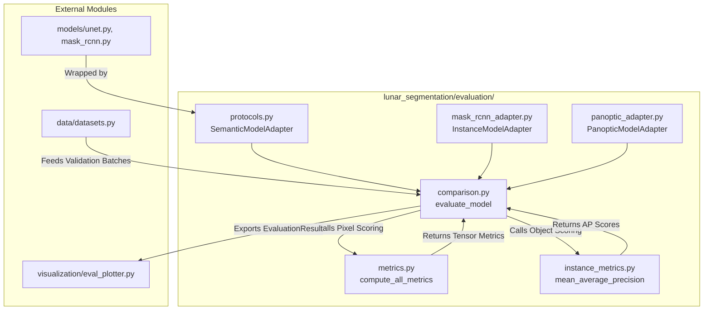

# Evaluation Module

## 1. Folder Overview
The `evaluation` directory provides a rigorous quantitative validation and statistical hypothesis testing framework for lunar geological segmentation architectures. It implements vectorized pixel-level semantic metrics (IoU, Dice, Precision, Recall), object-level instance segmentation metrics (COCO-style Average Precision), standardized structural adapters for disparate neural network outputs, and non-parametric statistical significance testing (Wilcoxon signed-rank tests and bootstrap confidence intervals).

---

## 2. File Index
* **`comparison.py`**: Orchestrates end-to-end evaluation campaigns across validation dataloaders (`EvaluationResult`, `evaluate_model()`), computes bootstrap confidence intervals (`bootstrap_confidence_interval()`), executes non-parametric statistical hypothesis tests (`significance_test()`), and formats comparative LaTeX/Markdown reporting tables (`generate_report_table()`).
* **`instance_metrics.py`**: Implements object-level detection and segmentation evaluation (`InstanceEvaluationResult`, `average_precision()`, `mean_average_precision()`), calculating greedy bounding box and mask matching via pairwise Intersection over Union (`mask_pairwise_iou()`).
* **`mask_rcnn_adapter.py`**: Implements `InstanceModelAdapter`, wrapping raw Faster/Mask R-CNN prediction dictionaries to conform to unified evaluation interfaces and extracting binary masks for metric scoring.
* **`metrics.py`**: Implements core differentiable-safe and vectorized pixel-level semantic metrics (`iou()`, `dice_coefficient()`, `precision()`, `recall()`, `f1_score()`), confusion matrix decomposition (`confusion_components()`), and decision threshold sensitivity sweeping (`threshold_sweep()`).
* **`panoptic_adapter.py`**: Implements `PanopticModelWrapper` and `PanopticModelAdapter`, bridging complex multi-output panoptic feature pyramid networks into standardized semantic and instance metric evaluation pipelines.
* **`protocols.py`**: Defines structural typing interfaces (PEP 544 `Protocol`) and dynamic registry mechanisms (`SegmentationModel`, `SemanticModelAdapter`, `register_adapter()`, `create_adapter()`) to decouple metric calculation from underlying model architectures.

---

## 3. Topology and Data Flow
Within the directory, evaluation is decoupled from model internals via adapter protocols: `protocols.py`, `mask_rcnn_adapter.py`, and `panoptic_adapter.py` wrap raw neural network architectures. The high-level orchestrator in `comparison.py` invokes these adapters to generate standardized predictions, passing them to `metrics.py` for dense pixel metrics and `instance_metrics.py` for object-level Average Precision. The aggregated metrics are then synthesized into statistical significance reports.
Externally, this directory **imports** and interacts with:
* **`models/`**: Wraps neural network models (`SmallUNet`, `MaskRCNN`, `PanopticFPN`) via structural adapters.
* **`data/`**: Ingests validation batches from PyTorch DataLoaders (`MoonTileDataset`).
* **`visualization/`**: Exports `EvaluationResult` objects to plotting utilities (`eval_plotter.py`) for visual diagnostics.

---

## 4. Core APIs and Functions

### `comparison.py`
#### `evaluate_model(model: Any, dataloader: DataLoader, class_names: Optional[List[str]], device: Optional[Union[str, torch.device]], threshold: float) -> EvaluationResult`
* **Purpose**: Executes an automated evaluation loop over an entire validation or test dataloader, aggregating per-sample and per-class metrics into a unified result object.
* **Input**:
  * `model` (`Any`): A PyTorch model or wrapped adapter conforming to `SegmentationModel`.
  * `dataloader` (`torch.utils.data.DataLoader`): Feeds validation image and target mask batches.
  * `class_names` (`Optional[List[str]]`): Ordered list of target geological feature names.
  * `device` (`Optional[Union[str, torch.device]]`): Hardware execution device (`'cuda'` or `'cpu'`).
  * `threshold` (`float`): Probability threshold for binarizing sigmoid logits (default: `0.5`).
* **Output**: An `EvaluationResult` data class containing per-class means, sample-level metric distributions, and raw confusion components.

#### `significance_test(result_a: EvaluationResult, result_b: EvaluationResult, metric: str) -> Dict[str, Any]`
* **Purpose**: Performs non-parametric Wilcoxon signed-rank testing on paired per-sample metric distributions to determine whether performance differences between two models are statistically significant.
* **Input**: `result_a` (`EvaluationResult`), `result_b` (`EvaluationResult`), `metric` (`str`, e.g., `'iou'` or `'dice'`).
* **Output**: A dictionary containing `'statistic'`, `'p_value'`, `'significant'` (`bool` at alpha 0.05), and class-stratified test breakdowns.

### `metrics.py`
#### `compute_all_metrics(preds: torch.Tensor, targets: torch.Tensor, num_classes: int, threshold: float, reduction: str) -> Dict[str, torch.Tensor]`
* **Purpose**: Computes the complete suite of dense semantic segmentation metrics (IoU, Dice, Precision, Recall, F1) across all feature classes in a single optimized pass.
* **Input**: `preds` (`torch.Tensor` of shape `[B, C, H, W]` logits or probabilities), `targets` (`torch.Tensor` of shape `[B, H, W]` or one-hot `[B, C, H, W]`), `num_classes` (`int`), `threshold` (`float`), `reduction` (`str`: `'mean'`, `'none'`, or `'sum'`).
* **Output**: A dictionary `Dict[str, torch.Tensor]` mapping metric names (`'iou'`, `'dice'`, etc.) to scalar or per-class tensors.

#### `threshold_sweep(preds: torch.Tensor, targets: torch.Tensor, num_classes: int, thresholds: Sequence[float]) -> Dict[float, Dict[str, torch.Tensor]]`
* **Purpose**: Evaluates model sensitivity across a discrete sequence of decision thresholds, enabling optimal threshold selection for unbalanced feature classes.
* **Input**: `preds` (`torch.Tensor`), `targets` (`torch.Tensor`), `num_classes` (`int`), `thresholds` (`Sequence[float]`).
* **Output**: A nested dictionary mapping each float threshold to its computed metric dictionary.

### `instance_metrics.py`
#### `mean_average_precision(predictions: List[Dict[str, torch.Tensor]], targets: List[Dict[str, torch.Tensor]], iou_thresholds: Sequence[float], num_classes: int) -> InstanceEvaluationResult`
* **Purpose**: Computes COCO-style Mean Average Precision (mAP) for instance segmentation across multiple IoU overlap thresholds (e.g., 0.50 to 0.95).
* **Input**: `predictions` (`List[Dict[str, torch.Tensor]]` containing predicted `'boxes'`, `'scores'`, `'labels'`, and `'masks'`), `targets` (`List[Dict[str, torch.Tensor]]` ground truth annotations), `iou_thresholds` (`Sequence[float]`), `num_classes` (`int`).
* **Output**: An `InstanceEvaluationResult` encapsulating mAP@0.50:0.95, AP@0.50, AP@0.75, and per-class precision-recall curves.
