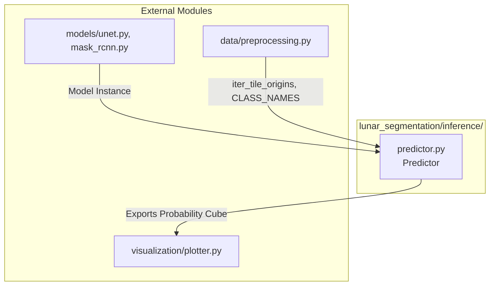

# Inference Module

## 1. Folder Overview
The `inference` directory provides high-performance prediction pipelines designed to deploy trained segmentation models onto large-scale lunar digital elevation models and optical rasters. It implements robust checkpoint state dictionary resolution and executes sliding-window inference with overlapping tile averaging, effectively mitigating edge discontinuities and boundary artifacts across extensive geographical mosaics.

---

## 2. File Index
* **`predictor.py`**: Encapsulates the `Predictor` engine, managing hardware device placement, model weight loading (handling flat state dictionaries and nested training checkpoints), and executing sliding-window probability mapping across arbitrary-resolution rasters.

---

## 3. Topology and Data Flow
Within the directory, `predictor.py` operates as an autonomous inference engine that bridges model architectures with preprocessed raster geometry. It initializes model instances, loads serialized weights, and systematically tiles input imagery to generate continuous probability cubes.
Externally, this directory **imports** functionality from:
* **`models/`**: Accepts initialized neural network architectures (`SmallUNet`, `MaskRCNN`, `PanopticFPN`) for forward pass evaluation.
* **`data/preprocessing.py`**: Consumes spatial partitioning utilities (`iter_tile_origins`) and geological class metadata (`CLASS_NAMES`) to guide sliding-window traversal.
* **`visualization/plotter.py`**: Supplies generated probability cubes and segmentation overlays to visual inspection tools.

---

## 4. Core APIs and Functions

### `predictor.py`
#### `class Predictor`
* **Purpose**: Orchestrates model deployment, state dictionary loading, and large-raster sliding-window inference with overlapping probability normalization.
* **Input**:
  * `model` (`torch.nn.Module`): Instantiated segmentation neural network architecture.
  * `weights_path` (`Optional[Path]`): File path to saved model checkpoint (`.pth` or `.pt`).
  * `device` (`str`): Target execution hardware (default: `'cuda'` if available else `'cpu'`).
* **Output**: An initialized `Predictor` instance ready for spatial evaluation.

#### `Predictor.predict(image_chw: np.ndarray, tile_size: int, stride: int) -> np.ndarray`
* **Purpose**: Executes sliding-window segmentation across a full-scale 3-channel lunar raster, accumulating sigmoid probability distributions and normalizing overlapping regions by an accumulation count buffer to produce seamless prediction maps.
* **Input**:
  * `image_chw` (`np.ndarray` of shape `[3, H, W]`): Input multi-channel lunar image array.
  * `tile_size` (`int`): Spatial dimensions of each evaluation square window in pixels (default: `128`).
  * `stride` (`int`): Step distance between consecutive window origins in pixels (default: `64`).
* **Output**: A 3D float32 numpy array of shape `[num_classes, H, W]` containing continuous pixel-level class probabilities scaled between `0.0` and `1.0`.
