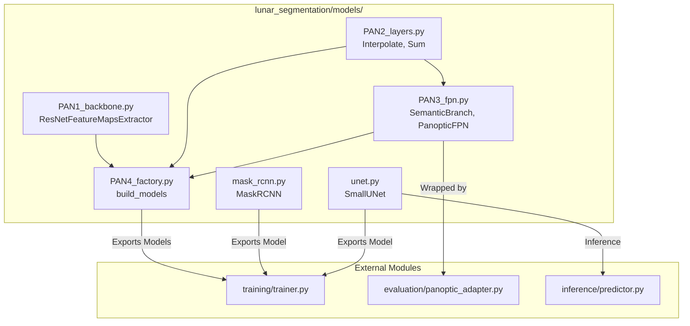

# Models Module

## 1. Folder Overview
The `models` directory implements the core deep learning neural network architectures used for lunar geological feature extraction and segmentation. It encapsulates semantic segmentation models (`SmallUNet`), instance segmentation architectures (`MaskRCNN`), and a unified panoptic understanding framework (`PanopticFPN`). These architectures are supported by multi-scale feature extractors, pyramid upsampling blocks, and modular factory builders designed for robust training and inference across lunar imagery tiles.

---

## 2. File Index
* **`PAN1_backbone.py`**: Implements multi-scale hierarchical feature extraction from ResNet-based backbones (`ResNetFeatureMapsExtractor`), returning structured tensors or dictionaries required by Feature Pyramid Networks (FPN) and Mask R-CNN heads.
* **`PAN2_layers.py`**: Defines atomic custom neural network layers (`Interpolate`, `Sum`) utilized for spatial upsampling and skip-connection feature addition within pyramid branches.
* **`PAN3_fpn.py`**: Contains the full `PanopticFPN` model implementation, integrating the torchvision Feature Pyramid Network with a `SemanticBranch` for dense semantic segmentation and `CustomMaskRCNNHeads` for object-level instance detection and masking.
* **`PAN4_factory.py`**: Provides factory functions and structural utilities (`build_models()`, `_get_shapes()`) to dynamically instantiate and configure pretrained backbones, semantic branches, and instance heads.
* **`mask_rcnn.py`**: Defines the `MaskRCNN` wrapper around torchvision's `maskrcnn_resnet50_fpn`, customizing box classification predictors and mask prediction heads specifically for lunar feature classes.
* **`unet.py`**: Implements the `SmallUNet` encoder-decoder architecture, featuring configurable network depth, base channel width, and dual-stage dropout (bottleneck and decoder) to mitigate overfitting on specialized lunar datasets.

---

## 3. Topology and Data Flow
Within the directory, the modules follow a hierarchical composition pattern: foundational building blocks (`PAN2_layers.py`) are imported by both the semantic branch in `PAN3_fpn.py` and the factory builder in `PAN4_factory.py`. The factory module (`PAN4_factory.py`) acts as an internal orchestrator by assembling `PAN1_backbone.py` and `PAN3_fpn.py` into a unified model structure.
Externally, this directory **exports** model constructors and instances to:
* **`training/`**: Consumed by training scripts and trainers (`Trainer`, `MaskRCNN_Trainer`, `PanopticTrainer`) for loss computation and weight optimization.
* **`inference/`**: Consumed by sliding-window prediction pipelines (`Predictor`).
* **`evaluation/`**: Wrapped by adapters (`PanopticModelWrapper`) for standardized evaluation protocols and validation metrics.

---

## 4. Core APIs and Functions

### `PAN4_factory.py`
#### `build_models(name: str, out_size: Tuple[int, int], fpn_channels: int, num_classes: int, pretrained: bool, in_channels: int) -> Tuple[nn.Module, nn.Module, nn.Module]`
* **Purpose**: Instantiates and configures the three foundational neural network modules required for panoptic segmentation.
* **Input**:
  * `name` (`str`): Backbone identifier (e.g., `'resnet18'`).
  * `out_size` (`Tuple[int, int]`): Target spatial dimensions for semantic output (e.g., `(256, 256)`).
  * `fpn_channels` (`int`): Number of hidden channels in the Feature Pyramid Network (default: `256`).
  * `num_classes` (`int`): Total number of segmentation classes, including background (default: `8`).
  * `pretrained` (`bool`): Whether to load pre-trained ImageNet weights.
  * `in_channels` (`int`): Input image channel count (default: `3`).
* **Output**: A 3-element tuple `(backbone, Semantic_branch, Instance_branch)` of type `Tuple[nn.Module, nn.Module, nn.Module]`.

### `PAN3_fpn.py`
#### `class PanopticFPN(nn.Module)`
* **Purpose**: Unified architecture that processes batched images through a ResNet backbone, scales features via an FPN, and evaluates both the semantic segmentation branch and instance detection heads simultaneously.
* **Input**: `images_list` (`List[torch.Tensor]` where each tensor has shape `[C, H, W]`), `targets` (`Optional[List[Dict[str, torch.Tensor]]]`).
* **Output**: A 4-element tuple `(semantic_output, detections, rpn_losses, roi_losses)`. `semantic_output` is a tensor of shape `[B, num_classes, H, W]`; `detections` is a list of dictionaries containing predicted `'boxes'`, `'labels'`, `'scores'`, and `'masks'`.

#### `class SemanticBranch(nn.Sequential)`
* **Purpose**: Progressively upsamples and combines multi-scale FPN feature maps from deepest to shallowest to generate dense, high-resolution semantic segmentation logits.
* **Input**: `fp_features` (`Tuple[torch.Tensor, ...]`, a tuple of 5 feature maps across ascending spatial resolutions).
* **Output**: A 4D tensor of shape `[B, out_channels, H_top, W_top]` containing unnormalized class logits.

### `mask_rcnn.py`
#### `class MaskRCNN(nn.Module)`
* **Purpose**: Instance segmentation model based on `maskrcnn_resnet50_fpn`, modified with custom bounding box classification and pixel-level mask prediction heads tailored to lunar morphological features.
* **Input**: `images` (`List[torch.Tensor]`), `targets` (`Optional[List[Dict[str, torch.Tensor]]]`).
* **Output**:
  * *Training*: `Dict[str, torch.Tensor]` containing scalar losses (`loss_classifier`, `loss_box_reg`, `loss_mask`, `loss_objectness`, `loss_rpn_box_reg`).
  * *Inference*: `List[Dict[str, torch.Tensor]]` containing predicted `'boxes'`, `'labels'`, `'scores'`, and `'masks'` per input image.

### `unet.py`
#### `class SmallUNet(nn.Module)`
* **Purpose**: Configurable encoder-decoder convolutional network for semantic segmentation of lunar imagery tiles, featuring customizable depth and targeted dropout layers to prevent overfitting.
* **Input**: Batched 4D image tensor `x` of shape `[B, in_channels, H, W]`.
* **Output**: Batched 4D logit tensor of shape `[B, num_classes, H, W]`.
