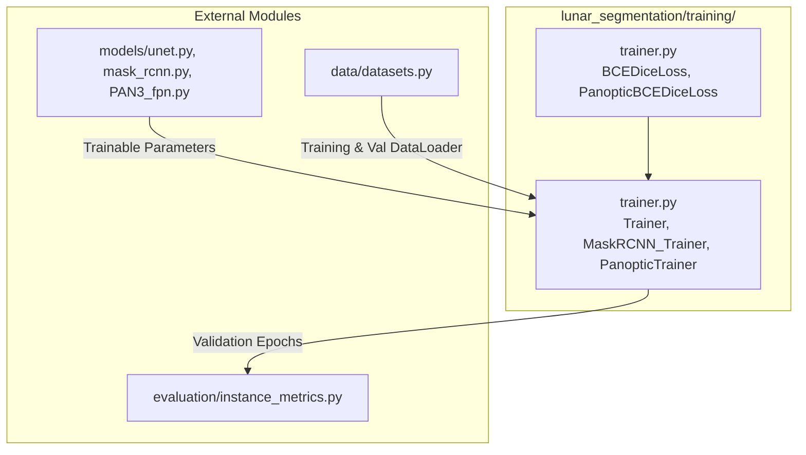

# Training Module

## 1. Folder Overview
The `training` directory provides optimization engines, custom loss functions, and training loops tailored to the distinct architectural requirements of lunar geological segmentation. It implements hybrid semantic loss formulations (weighted Binary Cross-Entropy combined with Dice loss), dynamic loss weighting mechanisms for class imbalance, learning rate warmup schedules, and specialized trainer classes for semantic (`Trainer`), instance (`MaskRCNN_Trainer`), and unified panoptic (`PanopticTrainer`) segmentation models.

---

## 2. File Index
* **`trainer.py`**: Contains all core training infrastructure, including differentiable loss functions (`dice_loss()`, `BCEDiceLoss`, `panoptic_dice_loss()`, `PanopticBCEDiceLoss`), torchvision loss customization closures (`_make_weighted_fastrcnn_loss()`, `_make_weighted_maskrcnn_loss()`), validation metric tracking (`multilabel_metrics()`), and optimization loop classes (`Trainer`, `MaskRCNN_Trainer`, `PanopticTrainer`).

---

## 3. Topology and Data Flow
Within the directory, `trainer.py` encapsulates optimization logic by coupling PyTorch optimizers and schedulers with specialized loss criteria. It dynamically modifies internal torchvision RoI loss criteria when per-class weighting is required, orchestrating forward passes, gradient backpropagation, and epoch-level validation logging.
Externally, this directory **imports** functionality from:
* **`models/`**: Ingests trainable neural network architectures (`SmallUNet`, `MaskRCNN`, `PanopticFPN`) to update their parameter weights.
* **`data/`**: Consumes batched training and validation samples from PyTorch DataLoaders (`MoonTileDataset`, `MoonTileTestDataset_RCNN`).
* **`evaluation/`**: Leverages object-level metrics (`mean_average_precision`) within `MaskRCNN_Trainer` during validation epochs.

---

## 4. Core APIs and Functions

### `trainer.py`
#### `class Trainer`
* **Purpose**: General-purpose optimization loop manager for semantic segmentation models (such as `SmallUNet`), executing epoch-level training, gradient clipping, validation loss evaluation, and metric logging.
* **Input**: `model` (`torch.nn.Module`), `optimizer` (`torch.optim.Optimizer`), `criterion` (`torch.nn.Module` loss function), `device` (`str`).
* **Output**: Instantiated semantic trainer. Key methods include `train_one_epoch(loader)` returning mean scalar training loss (`float`) and `evaluate(loader)` returning validation loss (`float`).

#### `class MaskRCNN_Trainer`
* **Purpose**: Specialized optimization orchestrator for Faster/Mask R-CNN architectures, implementing learning rate warmup schedules during initial epochs, gradient accumulation, and COCO-style Mean Average Precision tracking during validation.
* **Input**: `model` (`torch.nn.Module`), `optimizer` (`torch.optim.Optimizer`), `data_loader` (`DataLoader`), `data_loader_val` (`DataLoader`), `device` (`str`), `class_weights` (`Optional[torch.Tensor]`).
* **Output**: Instantiated instance segmentation trainer. Key methods include `train_one_epoch(epoch)` and `evaluate()`, which returns an `InstanceEvaluationResult` containing mAP metrics.

#### `class PanopticTrainer`
* **Purpose**: Multi-task optimization engine for `PanopticFPN` models, balancing semantic branch segmentation losses with instance proposal, bounding box regression, and pixel-level mask BCE losses.
* **Input**: `model` (`torch.nn.Module`), `optimizer` (`torch.optim.Optimizer`), `semantic_criterion` (`torch.nn.Module`), `device` (`str`), `class_weights` (`Optional[torch.Tensor]`).
* **Output**: Instantiated panoptic trainer capable of jointly training semantic and instance branches.

#### `class PanopticBCEDiceLoss(nn.Module)`
* **Purpose**: Hybrid loss function combining weighted Binary Cross-Entropy with differentiable Dice loss across multi-class one-hot segmentation targets, specifically formulated to handle extreme class imbalance in lunar geological features.
* **Input**: `logits` (`torch.Tensor` of shape `[B, C, H, W]`, unnormalized predictions), `targets` (`torch.Tensor` of shape `[B, H, W]`, long integer class indices where `0` is background).
* **Output**: A scalar float tensor representing the combined weighted loss.

#### `multilabel_metrics(logits: torch.Tensor, targets: torch.Tensor, threshold: float) -> pd.DataFrame`
* **Purpose**: Computes batch-level classification metrics (Precision, Recall, F1-score, IoU) independently for each geological class by binarizing prediction logits against target masks.
* **Input**: `logits` (`torch.Tensor` of shape `[B, C, H, W]`), `targets` (`torch.Tensor` of shape `[B, C, H, W]` or `[B, H, W]`), `threshold` (`float`, default: `0.5`).
* **Output**: A `pandas.DataFrame` detailing precision, recall, F1, and IoU stratified by class name.
