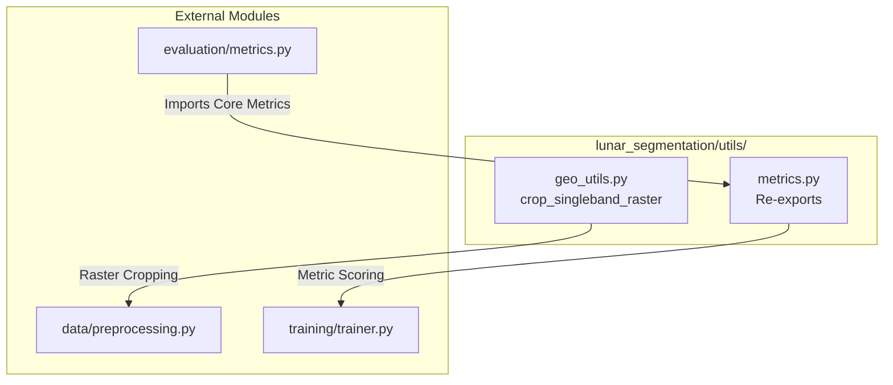

# Utilities Module

## 1. Folder Overview
The `utils` directory provides foundational helper libraries and geospatial manipulation functions required across the lunar segmentation pipeline. It implements coordinate reference system (CRS) transformations for planetary bodies, raster cropping routines for Equirectangular Moon projections, and convenience re-export wrappers that unify evaluation metric access across different project layers.

---

## 2. File Index
* **`geo_utils.py`**: Encapsulates planetary geospatial constants (`MOON_RADIUS_M`, `MOON_GEOG_CRS`) and raster windowing functions (`crop_singleband_raster()`), managing transformations between WGS84 geographic coordinates and native lunar metric projections.
* **`metrics.py`**: Serves as an architectural convenience re-export module, forwarding all dense pixel-level segmentation metrics (`iou()`, `dice_coefficient()`, `f1_score()`, `compute_all_metrics()`) from the core `evaluation` package to maintain clean package namespaces.

---

## 3. Topology and Data Flow
Within the directory, utilities act as standalone functional helper modules without internal inter-dependencies. They provide static methods and data transformation pipelines invoked by higher-level data processing and evaluation orchestration scripts.
Externally, this directory **exports** functions and constants to:
* **`data/preprocessing.py`**: Consumes raster windowing routines (`crop_singleband_raster`) during tile extraction over designated areas of interest.
* **`training/` & `inference/`**: Consumes re-exported evaluation metric functions via `utils.metrics` for validation monitoring.
It **imports** core definitions from:
* **`evaluation/metrics.py`**: Imports implementations of IoU, Dice, Precision, and Recall for re-exporting.

---

## 4. Core APIs and Functions

### `geo_utils.py`
#### `crop_singleband_raster(raster_path: Path, bounds: Tuple[float, float, float, float]) -> Tuple[np.ndarray, Affine, Dict[str, Any]]`
* **Purpose**: Extracts a spatial sub-window from a single-band geospatial raster based on geographic bounding coordinates, automatically handling coordinate reprojection between WGS84 degrees and native planetary metric projections (e.g., EPSG:9122 Equirectangular Moon).
* **Input**:
  * `raster_path` (`Path`): Absolute filesystem path to the target GeoTIFF raster file.
  * `bounds` (`Tuple[float, float, float, float]`): Bounding window specified as `(min_lon, min_lat, max_lon, max_lat)` in WGS84 decimal degrees.
* **Output**: A 3-element tuple `(img, transform, profile)` where `img` is a 2D numpy array containing cropped raster data, `transform` is a `rasterio.Affine` spatial transform matrix, and `profile` is a dictionary containing updated geospatial metadata.

### `metrics.py`
#### `Re-exported Evaluation Metrics`
* **Purpose**: Provides direct access to `lunar_segmentation.evaluation.metrics` functions including `iou()`, `dice_coefficient()`, `precision()`, `recall()`, `f1_score()`, `confusion_components()`, `compute_all_metrics()`, and `threshold_sweep()`.
* **Input/Output**: Exactly mirrors the API specifications defined in `lunar_segmentation.evaluation.metrics`.
