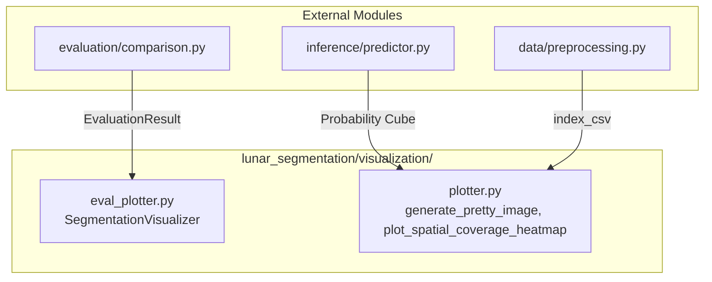

# Visualization Module

## 1. Folder Overview
The `visualization` directory implements a comprehensive graphical inspection and diagnostic plotting framework for lunar segmentation models. It generates publication-ready figures, multi-panel qualitative prediction summaries, spatial coverage heatmaps, threshold sensitivity curves, and pixel-level error classification overlays (highlighting True Positives, False Positives, and False Negatives) to facilitate detailed error analysis and model comparison.

---

## 2. File Index
* **`eval_plotter.py`**: Encapsulates the `SegmentationVisualizer` class and color-mapping utilities (`_build_error_rgba()`, `_to_2d()`) for generating structured diagnostic panels directly from standardized `EvaluationResult` objects.
* **`plotter.py`**: Provides general-purpose raster plotting, geographic heatmap rendering, and multi-class overlay utilities (`generate_pretty_image()`, `plot_spatial_coverage_heatmap()`, `plot_threshold_baseline()`, `plot_real_vs_prediction()`, `plot_iou_per_class()`).

---

## 3. Topology and Data Flow
Within the directory, plotting utilities operate on decoupled data structures: `plotter.py` processes numpy arrays and index CSVs directly, whereas `eval_plotter.py` consumes structured validation results to generate complex multi-panel figures. Both modules apply unified styling and color schemes to maintain visual consistency across all project outputs.
Externally, this directory **imports** data and results from:
* **`evaluation/comparison.py`**: Consumes `EvaluationResult` objects to render qualitative error maps and metric distributions.
* **`inference/predictor.py`**: Consumes raw probability cubes (`prob_cube`) to generate multi-class probability overlays.
* **`data/`**: Ingests dataset metadata catalogs (`index_csv`) to plot spatial coverage and class distribution heatmaps.

---

## 4. Core APIs and Functions

### `eval_plotter.py`
#### `class SegmentationVisualizer`
* **Purpose**: Comprehensive diagnostic visualization engine that renders multi-panel qualitative assessments, metric bar charts, threshold sensitivity plots, and error classification maps from validation evaluation outputs.
* **Input**: `class_names` (`Sequence[str]`), `style_override` (`Optional[Dict[str, Any]]`).
* **Output**: Initialized visualizer instance configured with standardized dark-mode publication aesthetics. Key methods include:
  * `plot_prediction_panel(image, gt_mask, pred_mask, class_idx)`: Returns a 4-panel `(matplotlib.figure.Figure, np.ndarray)` tuple showing raw imagery, ground truth, prediction, and color-coded error overlays (TP in green, FP in red, FN in blue).
  * `plot_metric_distribution(eval_result, metric)`: Returns a boxplot figure illustrating per-sample variance across validation tiles.

### `plotter.py`
#### `generate_pretty_image(gray_img: np.ndarray, prob_cube: np.ndarray, class_names: Sequence[str], output_path: Path, alpha: float) -> None`
* **Purpose**: Synthesizes a visually intuitive multi-class probability overlay on background grayscale lunar imagery, utilizing distinct color palettes per feature class with alpha blending.
* **Input**:
  * `gray_img` (`np.ndarray` of shape `[H, W]` or `[3, H, W]`): Background lunar image raster.
  * `prob_cube` (`np.ndarray` of shape `[num_classes, H, W]`): Predicted probability maps.
  * `class_names` (`Sequence[str]`): Names corresponding to probability channels.
  * `output_path` (`Path`): File destination for the saved visualization.
  * `alpha` (`float`): Transparency factor for overlay blending (default: `0.4`).
* **Output**: `None` (saves the rendered visualization directly to `output_path`).

#### `plot_spatial_coverage_heatmap(index_csv: Path, output_path: Path, grid_size: int) -> None`
* **Purpose**: Renders a geographic heatmap over the lunar coordinate system illustrating spatial density and tile sampling distribution across defined areas of interest.
* **Input**: `index_csv` (`Path` pointing to tile dataset index containing geographic bounding coordinates), `output_path` (`Path`), `grid_size` (`int`, default: `50`).
* **Output**: `None` (saves spatial distribution figure to disk).

#### `plot_threshold_baseline(image: np.ndarray, mask: np.ndarray, prob: np.ndarray, thresholds: Sequence[float], class_name: str, output_path: Path) -> None`
* **Purpose**: Generates a comparative visual grid demonstrating the effect of varying decision thresholds on binary segmentation masks against ground truth annotations.
* **Input**: `image` (`np.ndarray`), `mask` (`np.ndarray`), `prob` (`np.ndarray` probability map for target class), `thresholds` (`Sequence[float]`, e.g., `[0.2, 0.4, 0.6, 0.8]`), `class_name` (`str`), `output_path` (`Path`).
* **Output**: `None` (saves threshold sensitivity grid image to disk).
